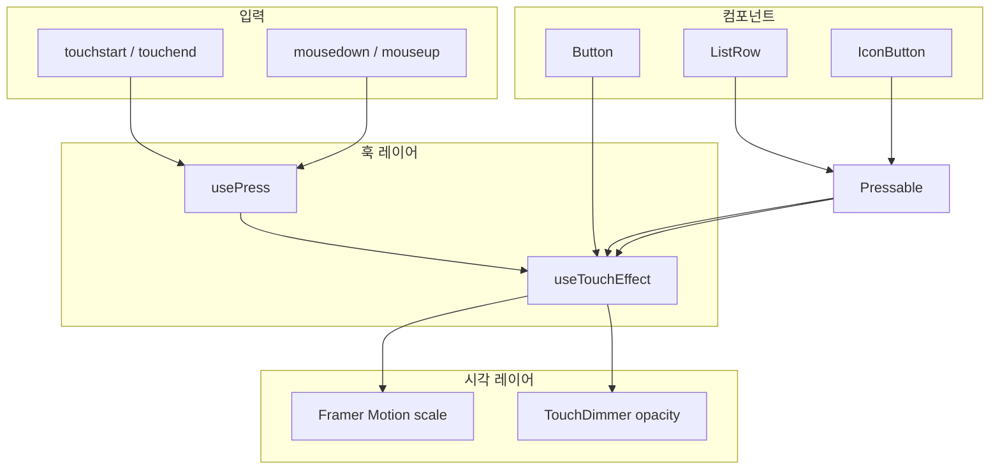

# Mobile Design System

토스 TDS(Toss Design System)의 **토큰 체계·터치 피드백 패턴**을 참고해 만든 **범용·독립** React 디자인 시스템입니다.

- **독립성**: Stackflow, Next.js, Vite 등 **어떤 React 앱**에서도 사용 가능. 앱 코드에 대한 import 없음.
- **Provider 패턴**: TDS `TDSMobileProvider` / Toss 앱 Provider처럼 `DSProvider`로 앱 루트를 감싼 뒤 컴포넌트 사용.
- **npm 배포 준비**: `package.json` + `styles/base.css` + Public API(`index.ts`) 분리. 추후 `npm install`로 설치 가능.
- **파운데이션**: Pretendard(npm) 폰트, TDS `colors` / `typography` 토큰, `Text` 프리미티브
- **인터랙션**: 버튼·리스트·아이콘 버튼 누를 때 **스케일 축소 + 딤 + 스프링 복귀**

---

## 빠른 시작 (현재 monorepo)

### 1. 스타일 로드 (호스트 앱 `src/index.css`)

```css
@import 'pretendard/dist/web/variable/pretendardvariable.css';
@import './design-system/styles/base.css';
/* + 호스트 Tailwind @theme (colors.ts와 동기화) */
```

### 2. Provider로 감싸기 (필수)

```tsx
// src/App.tsx
import { DSProvider } from './design-system'

function App() {
  return (
    <DSProvider>
      {/* 라우터, Stackflow Stack, 페이지 등 */}
    </DSProvider>
  )
}
```

### 3. 컴포넌트 사용

```tsx
import { Button, ListRow, Text, Top, ListHeader, Badge, Asset } from './design-system'

<Text typography="t5" color="grey700">본문</Text>
<Button color="primary" variant="fill" onClick={handleSubmit}>확인</Button>
```

---

## TDS Tier 1·2 컴포넌트 트리

```
ParagraphText (types/paragraphText.ts)
  ├── Text
  ├── TextButton
  ├── Top.*Paragraph / ListHeader.*Paragraph
  ├── ListRow.Texts
  └── Badge

Button (Action Primitive)
  └── (3단계) FixedBottomCTA

Top / ListHeader (Compound)
ListRow (3-slot: left | contents | right)
Asset.Frame + Asset.Icon
icons/ (레지스트리 — SVG 추가)
```

### Tier 1

| 컴포넌트 | TDS 대응 | 예시 |
|---------|----------|------|
| `Text` | Text | `<Text typography="t5">본문</Text>` |
| `Button` | Button v2 | `color` / `variant` / `size` / `display` |
| `TextButton` | TextButton | `size` + `variant="arrow"` |
| `Badge` | Badge | `size` + `variant` + `color` |
| `Top` | Top compound | `Top.TitleParagraph`, `Top.SubtitleParagraph` |

### Tier 2

| 컴포넌트 | TDS 대응 | 예시 |
|---------|----------|------|
| `ListHeader` | ListHeader | `TitleParagraph`, `RightArrow` |
| `ListRow` | ListRow v2 | `left` / `contents` / `right` 슬롯 |
| `ListRow.Texts` | Texts preset | `2RowTypeA`, `3RowTypeA`, `Right1RowTypeE`, `Right2RowTypeB` |
| `Asset.Icon` | Asset.Icon | `name` + `frameShape` |

### 화면 패턴

- **패턴 A** (서브 페이지): `Top` + `Text` + `Button`
- **패턴 B** (카드·목록): `ListHeader` + `ListRow` × N + `Asset.Icon`
- **패턴 C** (헤더 액션): `IconButton` + `TextButton` / `ListHeader.RightArrow`

---

## 추후 npm 설치 시 (독립 패키지)

패키지명 예시: `@stackflow-test/mobile-ds` (`package.json` 참고)

```bash
npm install @your-org/mobile-ds framer-motion pretendard
```

### 호스트 앱 설정

```tsx
// main.tsx 또는 App.tsx
import { DSProvider, Button, Text } from '@your-org/mobile-ds'
import '@your-org/mobile-ds/styles.css'
import 'pretendard/dist/web/variable/pretendardvariable.css'
```

```tsx
export function App() {
  return (
    <DSProvider config={{ hapticEnabled: true }}>
      <YourAppRoutes />
    </DSProvider>
  )
}
```

### peerDependencies

| 패키지 | 필수 | 역할 |
|--------|------|------|
| `react`, `react-dom` | ✅ | 컴포넌트·훅 |
| `framer-motion` | ✅ | press scale 애니메이션 |
| `pretendard` | 선택 | 호스트 CSS에서 로드 권장 |

### DSProvider config

| 옵션 | 기본값 | 설명 |
|------|--------|------|
| `hapticEnabled` | `true` | `false`면 햅틱 no-op (시각 피드백은 유지) |

```tsx
<DSProvider config={{ hapticEnabled: false }}>
  <App />
</DSProvider>
```

### useDS()

Provider 하위에서 전역 설정·햅틱에 접근합니다.

```tsx
import { useDS } from '@your-org/mobile-ds'

function CustomTab() {
  const { generateHaptic, reducedMotion, config } = useDS()
  // generateHaptic('tickWeak') — IconButton과 동일 패턴
}
```

---

## 한 줄 요약

> 터치/클릭 이벤트를 `usePress`로 통일하고 → `useTouchEffect`가 상태를 관리하고 → Framer Motion이 스케일·딤을 애니메이션합니다.

---

## 전체 구조

```
사용자 터치/클릭
       ↓
  usePress (이벤트 정규화)
       ↓
  useTouchEffect (pressed 상태 + DOM props)
       ↓
  Framer Motion (scale 애니메이션) + TouchDimmer (딤 오버레이)
       ↓
  Button / ListRow / IconButton (화면에 보이는 컴포넌트)
```



---

## 디렉토리 구조

```
design-system/              # ← 독립 npm 패키지 루트 (package.json 포함)
├── package.json            # 추후 npm publish용 manifest
├── index.ts                # Public API (외부에서 import하는 유일한 진입점)
├── styles/
│   └── base.css            # press 딤 CSS 변수 (호스트에서 @import)
├── provider/
│   ├── DSProvider.tsx      # 앱 루트 Provider (TDS TossProvider 패턴)
│   ├── DSContext.ts        # useDS() 훅
│   └── types.ts            # DSProviderConfig
├── tokens/
│   ├── colors.ts
│   ├── typography.ts
│   ├── motion.ts
│   └── touch.ts
├── hooks/
├── context/
│   └── TouchFeedbackContext.tsx  # deprecated alias → DSProvider
├── primitives/
├── components/
└── README.md
```

---

## 레이어별 동작 설명

### 1. 토큰 (`tokens/`)

#### colors.ts

TDS와 동일한 hex 팔레트. `@toss/tds-colors` 대신 이 파일을 import한다.

```tsx
import { colors } from '../design-system'
// colors.blue500, colors.grey900, colors.green500 ...
```

Tailwind `@theme`(`src/index.css`)의 `--color-*`와 동기화를 유지한다.

#### typography.ts

TDS typography 토큰(`t1`~`t7`, `st1`~`st13`)과 fontWeight(`regular`~`bold`).

```tsx
import { getTypographyStyle } from '../design-system'
getTypographyStyle('t5', 'regular') // { fontSize, lineHeight, fontWeight }
```

#### motion.ts / touch.ts

| 상수 | 값 | 의미 |
|------|-----|------|
| `spring.rapid` | stiffness 1000, damping 55 | **누를 때** — 빠르게 작아짐 |
| `spring.quick` | stiffness 800, damping 55 | **뗄 때** — 빠르게 원래 크기로 (약한 탄성) |
| `touchScale.default` | 0.96 | Button, ListRow 등 일반 요소 |
| `touchScale.compact` | 0.9 | IconButton 등 작은 히트 영역 |
| `PRESS_HOLD_MS` | 300 | 손을 뗀 뒤에도 눌림 상태를 잠깐 유지 |

### 2. Text 프리미티브

`fontSize`/`lineHeight` 하드코딩 대신 typography 토큰을 쓴다.

```tsx
import { Text } from '../design-system'

<Text typography="t3" fontWeight="bold" color="grey900">제목</Text>
<Text typography="t5">본문</Text>
<Text typography="t6" color="grey500">보조</Text>
```

폰트는 npm `pretendard` (Variable)를 `src/index.css`에서 로드한다.

---

### 3. `usePress` — 터치 이벤트 정규화

TDS의 `it` 훅과 같은 역할입니다. 브라우저마다 다른 이벤트를 **하나의 press 언어**로 바꿉니다.

| 브라우저 이벤트 | 변환 결과 |
|----------------|----------|
| `onTouchStart` | `onPressStart` |
| `onTouchEnd` | `onPressEnd` |
| `onTouchCancel` | `onPressCancel` |
| `onMouseDown` (좌클릭) | `onPressStart` |
| `window.mouseup` | `onPressEnd` (데스크톱) |

#### 300ms 유지가 있는 이유

손가락을 뗀 직후에도 약 300ms 동안 "눌린" 상태를 유지합니다. 너무 빨리 원래 크기로 돌아가면 눌림이 안 보이거나 깜빡이는 느낌이 납니다. TDS도 같은 패턴을 씁니다.

```
[누름]  → onPressStart 즉시 호출
[뗌]    → 300ms 후 onPressEnd 호출
```

#### 반환값

DOM 요소에 그대로 spread할 수 있는 props를 돌려줍니다.

```ts
{ onTouchStart, onTouchEnd, onTouchCancel, onMouseDown }
```

---

### 4. `useTouchEffect` — press + hover 합치기

TDS의 `En` 훅과 같은 역할입니다. `usePress` 위에 **React 상태**를 얹습니다.

- `pressed` — 지금 눌려 있는지 (딤 레이어 opacity에 사용)
- `hovered` — 마우스가 올라가 있는지 (데스크톱)
- `touchEffectProps` — DOM에 spread할 이벤트 묶음

```ts
const { pressed, touchEffectProps } = useTouchEffect({
  onPressStart: () => { /* 스케일 줄이기 */ },
  onPressEnd:   () => { /* 스케일 복귀 */ },
})
```

`onPressStart` / `onPressEnd`는 `usePress`를 거치므로, **뗄 때 콜백도 300ms 뒤에** 실행됩니다.

---

### 5. `TouchDimmer` — 딤(어두워짐) 레이어

스케일만으로는 TDS 느낌의 50%밖에 안 납니다. 실제로는 **2레이어**입니다.

1. **스케일** — 요소 전체가 `transform: scale(...)`로 작아짐
2. **딤** — 위에 겹친 반투명 오버레이의 `opacity`가 올라감

| variant | 용도 | CSS 변수 |
|---------|------|----------|
| `radial` | Button | `--press-dimmer-radial` (중앙에서 퍼지는 그라데이션) |
| `grey` | ListRow, IconButton | `--press-dimmer-color` (단색 반투명) |

색상은 [`index.css`](../index.css)의 `:root`에서 바꿀 수 있습니다.

---

### 6. `Pressable` — 범용 눌림 래퍼

`motion.div` + `useTouchEffect` + `TouchDimmer`를 합친 **가장 범용적인 블록**입니다.

`ListRow`, `IconButton`이 내부적으로 이걸 사용합니다.

```
┌─────────────────────────────┐
│  motion.div (scale 애니메이션) │
│  ┌───────────────────────┐  │
│  │  children (콘텐츠)     │  │
│  └───────────────────────┘  │
│  ┌───────────────────────┐  │
│  │  TouchDimmer (absolute)│  │
│  └───────────────────────┘  │
└─────────────────────────────┘
```

---

### 7. 컴포넌트별 스펙

| 컴포넌트 | 기반 | scale | 딤 | 특이사항 |
|---------|------|-------|-----|---------|
| `Button` | `motion.button` | 0.96 | radial | color: primary/dark/danger/light, variant: fill/weak |
| `ListRow` | `Pressable` | 0.96 | grey | title + description + value 슬롯 |
| `IconButton` | `Pressable` | 0.9 | grey | press 시 햅틱 `tickWeak` |

**바텀시트·모달 컨테이너 자체는 줄어들지 않습니다.** Stackflow UI가 시트 등장을 담당하고, 안의 버튼·리스트만 이 DS 애니메이션을 씁니다.

---

## 햅틱 (`useHaptic`) 상세

### 무엇을 하나요?

모바일 기기의 **짧은 진동**을 발생시킵니다. 브라우저 표준 API인 `navigator.vibrate()`를 사용합니다.

```ts
// useHaptic.ts
const HAPTIC_PATTERNS = {
  tickWeak: 10,              // 10ms 짧은 한 번 (탭 느낌)
  softWeak: [15, 30, 15],    // 15ms 진동 → 30ms 쉼 → 15ms 진동
}
```

| 타입 | 패턴 | 쓰이는 곳 |
|------|------|----------|
| `tickWeak` | `10` (10ms) | `IconButton` — 하단 탭 전환 |
| `softWeak` | `[15, 30, 15]` | 아직 미사용, 키패드 등에 예약 |

### 호출 흐름

```
IconButton onPressStart
       ↓
useDS().generateHaptic('tickWeak')
       ↓
DSProvider (context)
       ↓
useHaptic().generate('tickWeak')
       ↓
navigator.vibrate(10)
```

Provider를 거치는 이유: 나중에 햅틱 on/off 설정, iOS WebView 분기 등을 **한곳에서** 제어하기 위해서입니다.

### 햅틱이 동작하지 않는 경우 (정상)

| 환경 | 이유 |
|------|------|
| 데스크톱 PC | `navigator.vibrate` 없음 → 조용히 무시 |
| iOS Safari | 대부분 `vibrate` 미지원 → 무시 |
| 사용자 설정 | 기기에서 진동 꺼짐 |
| SSR | `navigator` 없음 → 무시 |

코드는 실패하지 않고 **그냥 return**합니다. 에러를 던지지 않습니다.

```ts
if (typeof navigator === 'undefined' || !navigator.vibrate) return
```

### 유의사항

- 햅틱은 **시각 피드백을 대체하지 않습니다.** 진동이 안 되는 환경이 많으므로 scale + 딤이 항상 함께 있어야 합니다.
- `IconButton`만 햅틱을 쓰고, `Button`/`ListRow`는 시각만 — TDS와 같은 구분입니다.
- 연속 호출 시 이전 진동이 취소될 수 있습니다. 탭 전환처럼 가끔 누르는 UI에 적합합니다.

---

## Provider (`DSProvider`)

TDS `TDSMobileProvider`와 동일한 패턴. [`App.tsx`](../App.tsx)에서 앱 루트를 감쌉니다.

```tsx
<DSProvider config={{ hapticEnabled: true }}>
  <Stack />
</DSProvider>
```

| 제공 값 (`useDS()`) | 설명 |
|---------|------|
| `reducedMotion` | `prefers-reduced-motion: reduce` 감지 |
| `generateHaptic` | 햅틱 발생 함수 (`hapticEnabled: false`면 no-op) |
| `config` | 병합된 Provider 설정 |

`useDS()`는 Provider 밖에서 쓰면 **에러를 던집니다.** `IconButton`은 반드시 `DSProvider` 안에 있어야 합니다.

> `TouchFeedbackProvider` / `useTouchFeedback`은 하위 호환 alias이며 deprecated입니다.

`reducedMotion`은 context에 올려두었지만, 현재 press scale은 **의도적으로 끄지 않습니다** (TDS와 동일). 나중에 시트 등장·툴팁 같은 큰 모션에만 적용할 예정입니다.

---

## 사용법

### import

```tsx
import { DSProvider, Button, ListRow, IconButton, Text, colors } from '../design-system'
```

### Button

```tsx
<Button variant="primary" fullWidth onClick={handleClick}>
  확인
</Button>

<Button variant="buy">매수</Button>
<Button variant="sell">매도</Button>
<Button variant="secondary">취소</Button>
```

### ListRow

```tsx
<ListRow
  title="화면 Push 전환"
  description="기본 스택 네비게이션"
  onClick={() => push('ScreenActivity', {})}
/>

<ListRow title="내 자산" value="₩12,450,000" />
```

### IconButton

```tsx
<IconButton active={isActive} label="홈" onClick={handleTab}>
  <HomeIcon />
</IconButton>
```

### 새 컴포넌트 만들 때

raw `<button>` + `active:bg-*` Tailwind 대신:

1. 클릭 가능한 카드/행 → `ListRow` 또는 `Pressable`
2. CTA/액션 버튼 → `Button`
3. 작은 아이콘 + 라벨 → `IconButton`

---

## 눌림 한 사이클 타임라인

```
0ms     touchstart / mousedown
        → onPressStart
        → scale: 1 → 0.96 (rapid 스프링)
        → dimmer opacity: 0 → 1

?ms     touchend / mouseup
        → 300ms 타이머 시작

+300ms  onPressEnd
        → scale: 0.96 → 1 (quick 스프링, 살짝 튕김)
        → dimmer opacity: 1 → 0

?ms     onClick (브라우저 기본, press와 별개)
        → 실제 비즈니스 로직 실행
```

**press(시각)와 click(동작)은 분리**되어 있습니다. 눌림 애니메이션은 빠르게 보여주고, `onClick`은 브라우저가 판단하는 시점에 실행됩니다.

---

## 성능 관련 처리

컴포넌트에 공통으로 들어가는 스타일:

```ts
willChange: 'transform'
WebkitTapHighlightColor: 'transparent'  // iOS 파란 하이라이트 제거
transform: 'translateZ(0)'              // GPU 레이어 힌트
```

`TouchDimmer`는 `pointer-events-none`이라 터치를 가로채지 않습니다.

---

## 주의사항 & 흔한 실수

### 1. raw `<button>` + `active:` CSS 쓰지 않기

```tsx
// ❌ DS 밖 — 스케일·스프링·딤 없음
<button className="active:bg-grey-50">...</button>

// ❌ text-sm, slate-* 등 비토큰 타이포/색상
<p className="text-sm text-slate-500">...</p>

// ✅
<Button variant="secondary">...</Button>
<Text typography="t6" color="grey500">...</Text>
```

### 2. `IconButton`은 DSProvider 필수

Provider 없이 쓰면 `useDS must be used within DSProvider` 에러가 납니다.

### 3. `ListRow`는 `div` 기반

시맨틱 `<button>`이 아니라 `Pressable`(div) + `role="button"`입니다. 키보드 Enter/Space는 `onKeyDown`으로 처리합니다.

### 4. 중첩 press 주의

`usePress`의 `onTouchStart`에서 `event.stopPropagation()`을 호출합니다. Pressable 안에 또 Pressable을 넣으면 이벤트가 꼬일 수 있습니다.

### 5. `disabled`일 때

`usePress`가 no-op, `onClick`도 `undefined`로 막습니다. 애니메이션과 클릭 모두 비활성화됩니다.

### 6. 데스크톱에서 마우스가 요소 밖으로 나갈 때

`useTouchEffect`의 `onMouseLeave`가 press를 강제 해제합니다. 버튼 밖에서 mouseup해도 정상 복귀합니다.

### 7. 햅틱 기대치

데스크톱 개발 중에는 진동이 없습니다. 모바일 실기기 또는 Android Chrome에서 확인하세요.

### 8. 숫자 조정은 tokens만

스케일을 0.94로 바꾸고 싶다면 `tokens/touch.ts`만 수정하세요. 컴포넌트마다 숫자를 하드코딩하지 마세요.

---

## 아직 구현되지 않은 것 (후속 작업)

- `Switch`, `FixedBottomCTA`, `NumberKeypad` 컴포넌트
- iOS 스와이프 백 영역(화면 왼쪽 30px) press 스킵 — `ListRow` prop으로 추가 예정
- Stackflow `AppScreen` appBar 뒤로가기 버튼 커스텀 프레스
- `reducedMotion`을 큰 전환 애니메이션에 연결
- `softWeak` 햅틱을 NumberKeypad 등에 적용

---

## 의존성

| 패키지 | 역할 |
|--------|------|
| `pretendard` | 기본 sans-serif 폰트 (Variable) |
| `framer-motion` | scale·opacity 스프링 애니메이션 |
| `react` | 훅, Context, 컴포넌트 |

Rally 등 별도 애니메이션 엔진은 사용하지 않습니다. Framer Motion 하나로 통일했습니다.

---

## 참고: TDS와의 대응 관계

| TDS | 이 프로젝트 |
|-----|------------|
| `it` (press hook) | `usePress` |
| `En` (touchEffectProps) | `useTouchEffect` |
| rapid / quick 스프링 | `tokens/motion.ts` |
| Button (Framer Motion) | `components/Button.tsx` |
| ListRow (Rally) | `components/ListRow.tsx` → `Pressable` + Framer Motion |
| TDS Provider | `DSProvider` |
| `useHaptic().generate()` | `useHaptic` + context `generateHaptic` |
