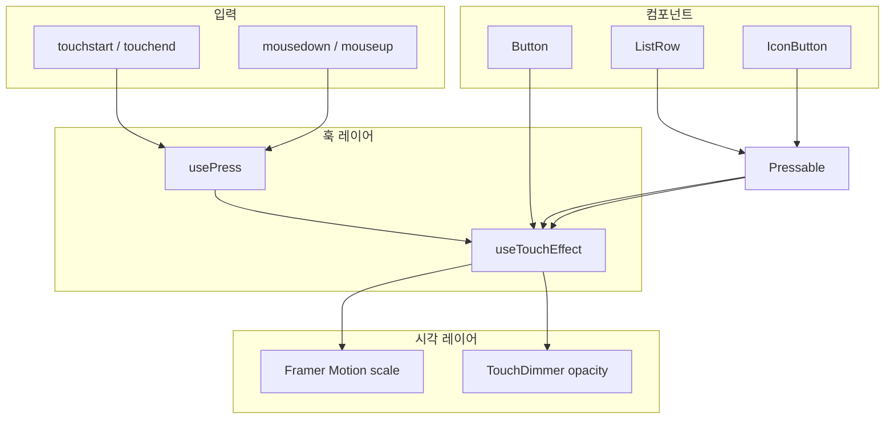

# Mobile Design System

토스 TDS(Toss Design System)의 **토큰 체계·컴포넌트 API·터치 피드백 패턴**을 참고해 만든 **범용·독립** React 디자인 시스템입니다.

| 특징 | 설명 |
|------|------|
| **독립성** | Stackflow, Vite, Next.js 등 어떤 React 앱에서도 사용. 앱 코드에 대한 역방향 import 없음 |
| **Provider** | `DSProvider`로 앱 루트를 감싼 뒤 컴포넌트 사용 (TDS `TDSMobileProvider` 패턴) |
| **ParagraphText** | `Text`, `Top`, `ListRow.Texts` 등 텍스트 UI가 **하나의 typography 토큰 체계**를 공유 |
| **아이콘** | 600+ SVG를 **번들에 넣지 않고** `fetch` + 메모리 캐시로 로드 |
| **터치 피드백** | 버튼·리스트·아이콘 버튼 누를 때 **스케일 축소 + 딤 + 스프링 복귀** |

---

## 목차

1. [빠른 시작](#빠른-시작)
2. [전체 구조 한눈에](#전체-구조-한눈에)
3. [ParagraphText — 텍스트 공통 기반](#paragraphtext--텍스트-공통-기반)
4. [컴포넌트 사용법](#컴포넌트-사용법)
5. [화면 패턴](#화면-패턴)
6. [아이콘 시스템](#아이콘-시스템)
7. [터치 피드백 동작 원리](#터치-피드백-동작-원리)
8. [DSProvider](#dsprovider)
9. [토큰](#토큰)
10. [추후 npm 설치](#추후-npm-설치)
11. [주의사항](#주의사항)
12. [로드맵](#로드맵)

---

## 빠른 시작

### 1. 스타일 로드 (호스트 앱 `src/index.css`)

```css
@import 'pretendard/dist/web/variable/pretendardvariable.css';
@import './design-system/styles/base.css';
/* Tailwind @theme — colors.ts·typography.ts와 동기화 */
```

### 2. Provider로 감싸기 (필수)

```tsx
// src/App.tsx
import { DSProvider } from './design-system'

export default function App() {
  return (
    <DSProvider>
      {/* Stackflow Stack, 라우터, 페이지 등 */}
    </DSProvider>
  )
}
```

`IconButton`은 `useDS()`를 사용하므로 **반드시** `DSProvider` 안에 있어야 합니다.

### 3. 컴포넌트 import

```tsx
import {
  Text,
  Button,
  ListRow,
  Top,
  ListHeader,
  Badge,
  Asset,
  Icon,
  ICON,
} from './design-system'
```

### 4. 최소 예시

```tsx
<Text typography="t5" color="grey700">본문</Text>

<Button color="primary" variant="fill" display="full" onClick={handleSubmit}>
  확인
</Button>

<ListRow
  contents={
    <ListRow.Texts
      type="2RowTypeA"
      top="화면 Push 전환"
      topProps={{ fontWeight: 'semibold', color: 'grey900' }}
      bottom="기본 스택 네비게이션"
      bottomProps={{ color: 'grey500' }}
    />
  }
  arrowType="right"
  onClick={() => push('ScreenActivity', {})}
/>
```

---

## 전체 구조 한눈에

### 컴포넌트 계층

```
ParagraphTextProps (types/paragraphText.ts)
  └── ParagraphTextRenderer
        ├── Text
        ├── TextButton
        ├── Top.TitleParagraph / Top.SubtitleParagraph
        ├── ListHeader.*Paragraph
        ├── ListRow.Texts
        └── Badge

Button (Action Primitive — motion.button)
ListRow (3-slot: left | contents | right) → Pressable
TextButton → Pressable
IconButton → Pressable + useDS().generateHaptic
Asset.Frame + Asset.Icon → Icon (fetch)

icons/
  mono/ · fill/  →  scripts/generate-icon-registry.mjs
                        →  registry.generated.ts (manifest)
                        →  public/icons/ (정적 호스팅)
                        →  Icon 컴포넌트 (fetch + 캐시)
```

### 터치 피드백 파이프라인

```
사용자 터치/클릭
       ↓
  usePress (이벤트 정규화)
       ↓
  useTouchEffect (pressed 상태 + DOM props)
       ↓
  Framer Motion (scale) + TouchDimmer (딤 오버레이)
       ↓
  Button / ListRow / IconButton
```



### 디렉토리 구조

```
design-system/
├── package.json              # 추후 npm publish manifest
├── index.ts                  # Public API (외부 import 진입점)
├── README.md
├── styles/base.css           # press 딤 CSS 변수
├── provider/
│   ├── DSProvider.tsx
│   ├── DSContext.ts          # useDS()
│   └── types.ts
├── tokens/                   # colors, typography, button, badge, asset, listRow, motion, touch
├── types/paragraphText.ts
├── primitives/
│   ├── ParagraphTextRenderer.tsx
│   ├── Pressable.tsx
│   └── TouchDimmer.tsx
├── hooks/                    # usePress, useTouchEffect, useHaptic, useReducedMotion
├── components/
│   ├── Button/
│   ├── TextButton/
│   ├── Badge/
│   ├── Top/
│   ├── ListHeader/
│   ├── ListRow/
│   ├── Asset/
│   └── IconButton.tsx
└── icons/                    # → icons/README.md 참고
    ├── mono/                 # 단색 SVG (667종)
    ├── fill/
    ├── registry.generated.ts # 자동 생성 manifest
    ├── registry.ts           # fetch + 캐시
    ├── Icon.tsx
    └── index.ts
```

---

## ParagraphText — 텍스트 공통 기반

TDS의 `ParagraphTextProps`와 같이, **모든 텍스트 UI가 typography 토큰을 공유**합니다.

```tsx
// ❌ fontSize, lineHeight, text-sm, slate-* 직접 지정 금지
<p className="text-sm text-slate-500">...</p>

// ✅ typography + fontWeight + color 토큰
<Text typography="t5" fontWeight="regular" color="grey700">본문</Text>
```

| typography | 용도 예시 |
|------------|----------|
| `t1`~`t3` | 페이지·섹션 제목 (`bold`/`semibold`) |
| `t4`~`t5` | 일반 본문 |
| `t6`~`t7`, `st10`~`st13` | 보조·캡션·메타 |

`ParagraphTextRenderer`를 직접 쓰기보다 `Text`, `Top.TitleParagraph` 등 **래퍼 컴포넌트**를 사용하세요.

---

## 컴포넌트 사용법

### Tier 1

#### `Text`

기본 텍스트 프리미티브. `as`로 시맨틱 태그를 지정할 수 있습니다.

```tsx
<Text typography="t3" fontWeight="bold" color="grey900" as="h1">제목</Text>
<Text typography="t5">본문</Text>
<Text typography="t6" color="grey500">보조 설명</Text>
```

#### `Button` (TDS Button v2)

| prop | 값 | 기본값 |
|------|-----|--------|
| `color` | `primary` · `dark` · `danger` · `light` | `primary` |
| `variant` | `fill` · `weak` | `fill` |
| `size` | `small` · `medium` · `large` · `xlarge` | `medium` |
| `display` | `inline` · `block` · `full` | `block` |
| `loading` | `boolean` | `false` |

```tsx
// 서브 페이지 CTA
<Button color="primary" variant="fill" display="full" onClick={handleNext}>
  다음 화면 Push
</Button>

// 보조 액션
<Button color="light" variant="fill" display="full" onClick={openSheet}>
  바텀시트 열기
</Button>

// 거래 화면 — 매수/매도
<Button color="primary" variant="fill" size="large" display="full">매수</Button>
<Button color="danger" variant="fill" size="large" display="full">매도</Button>
```

> 이전 `variant="buy"` / `variant="sell"` API는 제거되었습니다. `color="primary"` / `color="danger"`를 사용하세요.

#### `TextButton`

박스 없는 텍스트 액션. `size`는 필수입니다.

```tsx
<TextButton size="medium" onClick={handleMore}>
  더보기
</TextButton>

<TextButton size="small" variant="arrow" onClick={handleAll}>
  전체 보기
</TextButton>
```

| prop | 값 |
|------|-----|
| `size` | `small` · `medium` · `large` (필수) |
| `variant` | `clear` · `underline` · `arrow` |
| `color` | `ColorToken` (기본 `blue500`) |

#### `Badge`

상태·라벨 capsule.

```tsx
<Badge size="small" variant="fill" color="blue">신규</Badge>
<Badge size="medium" variant="weak" color="red">마감</Badge>
```

#### `Top` (Compound)

페이지 상단 영역. `AppScreen` appBar 아래 본문 헤더로 사용합니다.

```tsx
<Top
  title={
    <Top.TitleParagraph typography="t3" fontWeight="bold">
      스택 네비게이션
    </Top.TitleParagraph>
  }
  subtitleBottom={
    <Top.SubtitleParagraph>
      현재 스택 깊이:{' '}
      <Text typography="t6" fontWeight="bold" color="grey900" as="strong">
        {depth}
      </Text>
    </Top.SubtitleParagraph>
  }
/>
```

| 슬롯 | 설명 |
|------|------|
| `title` | 메인 제목 (필수) |
| `subtitleTop` | 제목 위 보조 |
| `subtitleBottom` | 제목 아래 보조 |
| `rightButton` | 우측 액션 |
| `lowerButton` | 하단 액션 |

---

### Tier 2

#### `ListHeader` (Compound)

섹션 헤더. 목록 블록 위에 배치합니다.

```tsx
<ListHeader
  title={
    <ListHeader.TitleParagraph typography="t4" fontWeight="bold">
      최근 거래
    </ListHeader.TitleParagraph>
  }
  description={
    <ListHeader.DescriptionParagraph color="grey500">
      최근 7일
    </ListHeader.DescriptionParagraph>
  }
  right={<ListHeader.RightArrow onClick={handleAll} />}
/>
```

#### `ListRow` v2 (3-slot Compound)

TDS ListRow v2와 같이 `left` · `contents` · `right` 슬롯으로 구성합니다.

```tsx
<ListRow
  left={<Asset.Icon name={ICON.HOURGLASS} frameShape="CircleSmall" />}
  contents={
    <ListRow.Texts
      type="2RowTypeA"
      top="화면 Push 전환"
      topProps={{ fontWeight: 'semibold', color: 'grey900' }}
      bottom="기본 스택 네비게이션"
      bottomProps={{ color: 'grey500' }}
    />
  }
  right={
    <ListRow.Texts
      type="Right1RowTypeE"
      top="₩12,450,000"
      topProps={{ fontWeight: 'bold', color: 'grey900' }}
    />
  }
  arrowType="right"
  verticalPadding="medium"
  onClick={handleClick}
/>
```

| prop | 값 | 기본값 |
|------|-----|--------|
| `arrowType` | `none` · `right` | `none` |
| `verticalPadding` | `small` · `medium` · `large` | `medium` |
| `withTouchEffect` | `boolean` | `true` |
| `onClick` | 없으면 정적 `div`, 있으면 `Pressable` | — |

**`ListRow.Texts` preset**

| type | 행 구성 | 정렬 |
|------|---------|------|
| `2RowTypeA` | top + bottom | 왼쪽 |
| `3RowTypeA` | top + middle + bottom | 왼쪽 |
| `Right1RowTypeE` | top | 오른쪽 |
| `Right2RowTypeB` | top + bottom | 오른쪽 |

문자열을 넘기면 기본 typography가 적용됩니다. `topProps` 등으로 `fontWeight`, `color`를 덮어쓸 수 있습니다.

#### `Asset` (Compound)

아이콘·이미지를 프레임 안에 배치합니다.

```tsx
<Asset.Icon
  name="icon-u231B-mono"
  frameShape="CircleSmall"
  backgroundColor="grey100"
  color="grey600"
/>
```

| `frameShape` | 용도 |
|--------------|------|
| `CircleSmall` | ListRow left 슬롯 |
| `CircleMedium` | 중간 크기 |
| `Squircle` | 앱 아이콘형 |

#### `IconButton`

하단 탭 등 **아이콘 + 라벨** 버튼. 3단계에서 TDS API(`variant`, `iconSize`)로 확장 예정.

```tsx
<IconButton active={isActive} label="홈" onClick={handleTab}>
  <Icon name={ICON.USER} size={24} color={isActive ? 'blue500' : 'grey500'} />
</IconButton>
```

`onPressStart` 시 `generateHaptic('tickWeak')`가 호출됩니다.

---

## 화면 패턴

실제 Activity에서 쓰는 조합입니다.

### 패턴 A — 서브 페이지 (`ScreenActivity`)

`Top` + `Button` 여러 개

```
AppScreen (appBar)
  └── Top (제목 + 부제)
  └── Button × N (full width CTA)
```

### 패턴 B — 카드 목록 (`HomeTabActivity`)

`Text` 안내 + `ListRow` 카드

```
AppScreen
  └── Text (안내 문구)
  └── ul > li (border 카드)
        └── ListRow.Texts (2RowTypeA) + arrowType="right"
```

### 패턴 C — 거래·액션 (`TradeTabActivity`)

가격 표시 + `Button` 그리드

```
Text (티커) + Text (가격, t1) + Text (등락)
Button color="primary" (매수) | Button color="danger" (매도)
```

### 패턴 D — 섹션 목록 (예정)

`ListHeader` + `ListRow` × N + `Asset.Icon`

---

## 아이콘 시스템

600개 이상 SVG를 **JS 번들에 포함하지 않습니다.** 빌드 시 `public/icons/`로 복사하고, 런타임에 `fetch`합니다.

```
mono/icon-foo-mono.svg
       ↓  npm run icons:generate
registry.generated.ts (name → filename)
public/icons/mono/icon-foo-mono.svg
       ↓  <Icon name="icon-foo-mono" />
fetch → prepareMonoSvg (currentColor 치환) → 메모리 캐시 → 렌더
```

| 항목 | 설명 |
|------|------|
| **mono** | `color` prop으로 색상 변경 (`currentColor` 치환) |
| **fill** | SVG 원본 색상 유지 |
| **ICON 상수** | 자주 쓰는 name (`ICON.ARROW_RIGHT` 등) |
| **TypeScript** | `IconName` 타입으로 자동완성 |

```tsx
import { Icon, ICON } from './design-system'

<Icon name="icon-arrow-right-mono" size={24} color="grey600" />
<Icon name={ICON.HOURGLASS} size={18} color="blue500" />
```

아이콘 추가·파일명 규칙·동작 상세는 [`icons/README.md`](./icons/README.md)를 참고하세요.

---

## 터치 피드백 동작 원리

> 터치/클릭 → `usePress` 정규화 → `useTouchEffect` 상태 → Framer Motion 스케일 + `TouchDimmer` 딤

### `usePress` — 이벤트 정규화

| 브라우저 이벤트 | 변환 |
|----------------|------|
| `onTouchStart` | `onPressStart` |
| `onTouchEnd` | `onPressEnd` (300ms 지연) |
| `onMouseDown` | `onPressStart` |
| `window.mouseup` | `onPressEnd` |

**300ms 유지**: 손을 뗀 직후에도 잠깐 눌린 상태를 유지해 깜빡임을 방지합니다 (TDS와 동일).

### `TouchDimmer` — 2레이어 피드백

1. **스케일** — `transform: scale(0.96)` (IconButton은 `0.9`)
2. **딤** — 위에 겹친 반투명 오버레이

| variant | 사용처 |
|---------|--------|
| `radial` | `Button` |
| `grey` | `ListRow`, `TextButton`, `IconButton` |

### 컴포넌트별 스펙

| 컴포넌트 | 기반 | scale | 딤 | 햅틱 |
|---------|------|-------|-----|------|
| `Button` | `motion.button` | 0.96 | radial | — |
| `ListRow` | `Pressable` | 0.96 | grey | — |
| `TextButton` | `Pressable` | 0.96 | grey | — |
| `IconButton` | `Pressable` | 0.9 | grey | `tickWeak` |

### 눌림 타임라인

```
0ms     touchstart → scale 1→0.96, dimmer 0→1
?ms     touchend → 300ms 타이머
+300ms  scale 0.96→1, dimmer 1→0
?ms     onClick (브라우저, press와 별개)
```

**press(시각)와 click(동작)은 분리**되어 있습니다.

### 햅틱 (`useHaptic`)

| 타입 | 패턴 | 사용처 |
|------|------|--------|
| `tickWeak` | 10ms | `IconButton` 탭 전환 |
| `softWeak` | [15,30,15] | 예약 (키패드 등) |

데스크톱·iOS Safari에서는 `navigator.vibrate` 미지원 → 조용히 무시. 시각 피드백이 항상 함께 있어야 합니다.

---

## DSProvider

```tsx
<DSProvider config={{ hapticEnabled: true }}>
  <App />
</DSProvider>
```

| `useDS()` 값 | 설명 |
|-------------|------|
| `reducedMotion` | `prefers-reduced-motion` 감지 (press scale은 현재 유지) |
| `generateHaptic` | `hapticEnabled: false`면 no-op |
| `config` | 병합된 Provider 설정 |

> `TouchFeedbackProvider` / `useTouchFeedback`은 deprecated alias입니다.

---

## 토큰

### colors (`tokens/colors.ts`)

TDS hex 팔레트. Tailwind `@theme`(`src/index.css`)와 동기화합니다.

```tsx
import { colors } from './design-system'
// colors.blue500, colors.grey900 ...
```

### typography (`tokens/typography.ts`)

```tsx
import { getTypographyStyle } from './design-system'
getTypographyStyle('t5', 'regular') // { fontSize, lineHeight, fontWeight }
```

### motion / touch

| 상수 | 값 | 의미 |
|------|-----|------|
| `spring.rapid` | stiffness 1000, damping 55 | 누를 때 |
| `spring.quick` | stiffness 800, damping 55 | 뗄 때 |
| `touchScale.default` | 0.96 | Button, ListRow |
| `touchScale.compact` | 0.9 | IconButton |
| `PRESS_HOLD_MS` | 300 | 눌림 유지 시간 |

스케일·스프링 값은 **컴포넌트가 아닌 `tokens/`만** 수정하세요.

---

## 추후 npm 설치

패키지명 예시: `@stackflow-test/mobile-ds` (`package.json` 참고)

```bash
npm install @your-org/mobile-ds framer-motion pretendard
```

```tsx
import { DSProvider, Button, Text } from '@your-org/mobile-ds'
import '@your-org/mobile-ds/styles.css'
import 'pretendard/dist/web/variable/pretendardvariable.css'

export function App() {
  return (
    <DSProvider config={{ hapticEnabled: true }}>
      <YourApp />
    </DSProvider>
  )
}
```

| peerDependency | 필수 | 역할 |
|----------------|------|------|
| `react`, `react-dom` | ✅ | 컴포넌트·훅 |
| `framer-motion` | ✅ | press scale |
| `pretendard` | 선택 | 호스트 CSS에서 로드 권장 |

---

## 주의사항

### 1. raw `<button>` + `active:` CSS 금지

```tsx
// ❌
<button className="active:bg-grey-50">...</button>

// ✅
<Button color="light" variant="fill">...</Button>
```

### 2. typography·색상 토큰 사용

```tsx
// ❌ text-sm, slate-*, fontSize 인라인
// ✅ <Text typography="t6" color="grey500">
```

### 3. `IconButton`은 DSProvider 필수

Provider 밖에서 `useDS must be used within DSProvider` 에러.

### 4. `ListRow`는 `div` + `role="button"`

시맨틱 `<button>`이 아닙니다. Enter/Space는 `onKeyDown` 처리.

### 5. 중첩 Pressable 주의

`usePress`가 `stopPropagation`을 호출합니다. Pressable 안에 Pressable을 넣지 마세요.

### 6. 바텀시트·모달 컨테이너

시트/모달 **컨테이너 자체**는 줄어들지 않습니다. 안의 버튼·리스트만 DS 애니메이션을 씁니다.

### 7. 아이콘 빌드

`dev` / `build` 전에 `icons:generate`가 자동 실행됩니다. SVG 추가 후 manifest가 갱신되는지 확인하세요.

---

## 로드맵

| 항목 | 상태 |
|------|------|
| Tier 1·2 컴포넌트 | ✅ |
| SVG 아이콘 레지스트리 (667 mono) | ✅ |
| `FixedBottomCTA` | 예정 |
| `IconButton` TDS API (`variant`, `iconSize`, `aria-label`) | 예정 |
| `DSProvider` `brandPrimaryColor` / `fontScaleAvailable` | 예정 |
| iOS 스와이프 백 영역 press 스킵 | 예정 |
| `Switch`, `NumberKeypad` | 예정 |

---

## TDS 대응 관계

| TDS | 이 프로젝트 |
|-----|------------|
| `ParagraphTextProps` | `types/paragraphText.ts` |
| Button v2 (`color`/`variant`) | `components/Button/Button.tsx` |
| ListRow v2 (3-slot) | `components/ListRow/` |
| `it` (press hook) | `usePress` |
| `En` (touchEffectProps) | `useTouchEffect` |
| TDS Provider | `DSProvider` |
| `@toss/tds-colors` | `tokens/colors.ts` |
| `@toss/tds-mobile` typography | `tokens/typography.ts` + `Text` |

---

## 의존성

| 패키지 | 역할 |
|--------|------|
| `pretendard` | 기본 sans-serif (Variable) |
| `framer-motion` | scale·opacity 스프링 |
| `react` | 훅, Context, 컴포넌트 |
